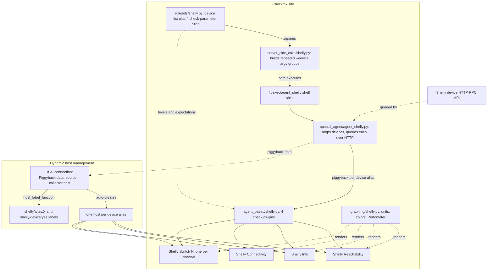

# shelly: end-to-end flow

Reading it top to bottom: `rulesets/shelly.py` is the only thing you
ever touch by hand to add a device or tune a threshold. Everything from
`server_side_calls` through the four check plugins runs automatically
on Checkmk's normal check cycle; the DCD half runs independently,
watching the same piggyback output to keep host objects in sync with
whatever devices are actually configured.
